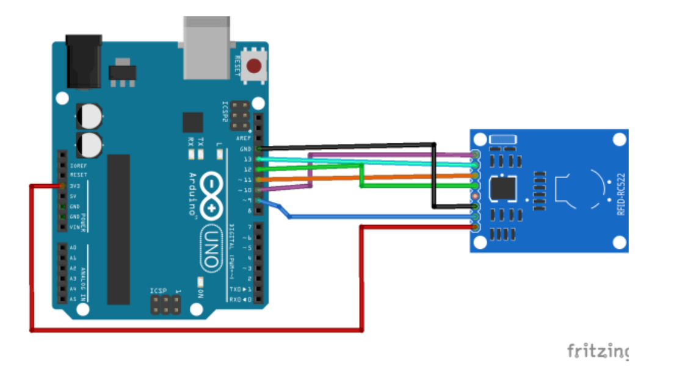

# Capteur de stationnement (version simple avec HC-SR04 + LEDs + buzzer)

## Auteur
Elkhoulati Yahya

## Aperçu du Projet

Dans ce projet, nous avons un capteur à ultrasons qui mesure la distance et un graphique à barres LED qui s'allume en fonction de notre distance par rapport au capteur. Lorsque nous nous rapprochons du capteur, le buzzer émet un bip différent. Ce circuit peut fonctionner comme un capteur de stationnement.

### Objectifs

- Mesurer la distance d'un obstacle avec un 'HC-SR04'.
- Allumer progressivement les 'LEDs' (Vert -> Jaune -> Rouge) en fonction de la proximité.
- Activer le 'buzzer' quand l'objet est trop proche.

---

## Composants

- **Arduino Uno**
- **HC-SR04**       : Capteur ultrasonique.
- **74HC595**       : Registre à décalage pour contrôler les LEDs.
- **LEDs**          : 2 Vertes, 3 Jaunes, 3 Rouges.
- **Rrésistances**  : 9 x 220 Ω.
- **Buzzer**
- **Breadboard**
- **Jumper wires**

---

## Schéma de Câblage



---

### Exemple de Code

```cpp
int tonePin = 4;
int trigPin = 9;
int echoPin = 10;

byte possible_patterns[9] = {
    B00000000,
    B00000001,
    B00000011,
};

void setup(){
    Serial.begin(9600);
    pinMode(trigPin, OUTPUT);
    pinMode(echoPin, INPUT);
}

void loop(){
    digitalWrite(trigPin, HIGH);
    delayMicroseconds(1000);
    digitalWrite(trigPin, LOW);
    
    delay(600);
    noTone(tonePin);
}
```

---

### Structure du Projet

```
📂 Parking-Sensor-Project
├── README.md
├── Code
│   └── parking_sensor.ino
├── Images
│   ├── schema_cablage.png
└── LICENSE
```
---

**Lien vers le Dépôt GitHub :** [Votre Lien Ici]


