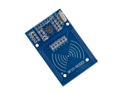
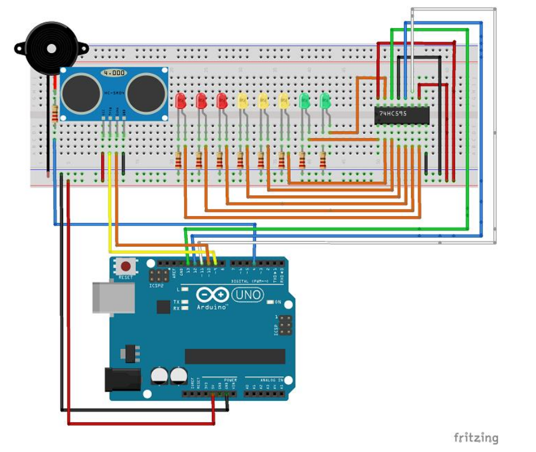
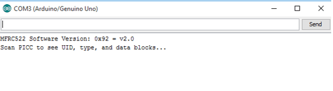
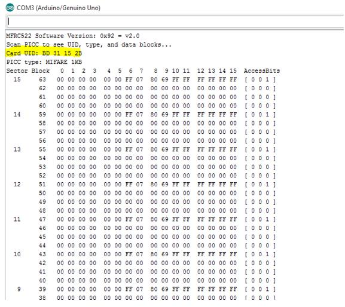
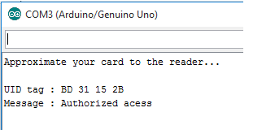
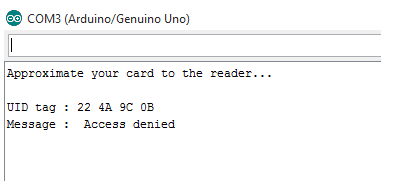

# Accès sécurisé à l'aide d'un lecteur RFID MFRC522 avec Arduino

## Auteur
Elkhoulati Yahya

## Aperçu du Projet

Ce projet présente un exemple simple d'utilisation du lecteur RFID MFRC522. Je vais vous donner
un aperçu rapide des spécifications et vous montrer un exemple de projet utilisant un
Arduino.

## Description

RFID signifie identification par radiofréquence. La RFID utilise des champs électromagnétiques pour
transférer des données sur de courtes distances. La RFID est utile pour identifier des personnes, effectuer des
transactions, etc.
Vous pouvez utiliser un système RFID pour ouvrir une porte. Par exemple, seule la personne disposant des
informations correctes sur sa carte est autorisée à entrer. Un système RFID utilise :
- Les tags sont attachés à l'objet à identifier, dans cet exemple nous avons un porte-clés et une carte électromagnétique. Chaque tag possède son propre identifiant(UID).
    
- Émetteur-récepteur radio bidirectionnel, le lecteur, qui envoie un signal à l'étiquette et lit sa réponse.
    

---

## Téléchargement de la bibliothèque
Voici la bibliothèque dont vous avez besoin pour ce projet :
1. Cliquez ici pour télécharger la bibliothèque RFID. Vous devriez avoir un dossier .zip dans votre dossier Téléchargements
2. Décompressez le dossier .zip et vous devriez obtenir le dossier RFID-master
3. Renommez votre dossier RFID-master en RFID
4. Déplacez le dossier RFID vers le dossier des bibliothèques d'installation de votre IDE Arduino
5. Enfin, rouvrez votre IDE Arduino

---

## Schéma de Câblage



---

## Lecture des données d'une étiquette RFID

Une fois le circuit prêt, allez dans Fichier -> Exemples -> MFRC522 -> DumpInfo et
téléchargez le code. Ce code est disponible dans votre IDE Arduino après avoir installé la bibliothèque RFID.

Ouvrez ensuite le moniteur série. Vous devriez voir quelque chose comme l'image ci-dessous :

    
    
Approchez la carte RFID ou le porte-clés du lecteur. Rapprochez le lecteur et l'étiquette
jusqu'à ce que toutes les informations s'affichent.
    
    
    
    
Voici les informations que vous pouvez lire sur la carte, y compris l'UID de la carte qui
est surligné en jaune. Les informations sont stockées dans la mémoire qui est divisée en
segments et en blocs, comme vous pouvez le voir sur l'image précédente.
Vous disposez de 1024 octets de stockage de données divisés en 16 secteurs. Notez votre
UID de carte, car vous en aurez besoin plus tard.

### Exemple de Code

```cpp
#include <SPI.h>
#include <MFRC522.h>
#define SS_PIN 10
#define RST_PIN 9
MFRC522 mfrc522(SS_PIN, RST_PIN);
void setup(){
  Serial.begin(9600);
  while (!Serial);
  SPI.begin();
}
void loop(){
  if (! mfrc522.PICC_IsNewCardPresent()) {
    return;
  }
  
  Serial.println(" Access denied");
  delay(3000);
 }
 
//In code you need to change the following line with the UID card you’ve found previously.
if (content.substring(1) == “REPLACE WITH YOUR UID”)

```

---

## Demonstration

Approchez la carte que vous avez choisie pour donner accès et vous verrez :

     
     
     
Si vous rapprochez une balise d'un autre UID, le message de refus s'affichera :
     
      

### Structure du Projet

```
📂 Security_Access_RFID
├── Security_Access_RFID.md
├── LICENSE
├── Code
│   └── security_access_rfid.ino
└── Images
    ├── schema_cablage.png       
    ├── schema1.png        
    ├── schema2.png          
    ├── data1.png          
    ├── data2.png          
    ├── reslt1.png       
    └── reslt2.png         
        
```
---

**Lien vers le Dépôt GitHub :** [https://github.com/ElkhoulatiYahya/Security_Access_RFID]


